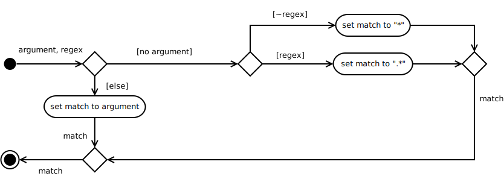

The Finder
==========

.. code:: python

    """
    The Finder.
    
    This is a recursive file-finder that travels down a path tree looking for files that match a glob. It was meant to be used by other code, but I thought it might be useful.
    
    Usage:             finder [--shallow] [--regex] [<expression>] [--root=<root>]
    
    Arguments:    
        <expression>        Glob (or regex) to match files (e.g. "*.pnw"). Quotes are required to prevent shell-expansion.
    
    Options:
        -s, --shallow      List only what's in the root (don't traverse down the tree).
        -r, --root=<root>  Root directory to start search (defaults to current working directory).
        --regex            Intrepret the expression as a regex instead of a glob
        -h, --help         Show this screen.
        -v, --version      Show version.
    """

This adds a command-line interface to the :ref:`find generator <find-generator>`.

The Schema
----------

This will create the validation for the arguments.

Arguments Class
~~~~~~~~~~~~~~~

This is a class to (hopefully) make spelling errors easier to catch. The attributes are the names of the options and arguments in the `docopt` dictionary.

.. code:: python

    class Arguments(object):
        """
        Constants to reduce typing errors
        """
        __slots__ = ()
        expression = "<expression>"
        root = "--root"
        shallow = "--shallow"
        regex = "--regex"
    

Glob From None
~~~~~~~~~~~~~~

This is a function to convert the ``expression`` argument to a default based on whether the expectation is to match a glob or a regular expression (or not to set anything if the user passed in an *expression*). If the user didn't specify anything then the expression will be set to match everything. It wouldn't really make sense for someone to specify a regular expression and then not set the expression but I figured I had to handle the case where they did anyway.

.. code:: python

    def glob_from_none(expresion, regex=False):
        """
        sets an expression to match all files if not given
    
        :param:
    
         - `expression`: the <expression> passed in by the user
         - `regex`: Boolean set by --regex
    
        :return: expression if not None or '*' or '.*' depending on regex
        """
        if expresion is None:
            if not regex:
                return '*'
            return '.*'
        return expresion
    

This might seem like overkill, but it was originally meant to be used by the schema to validate the glob before I decided to allow a default regular expression as well as a default glob.

The Schema
~~~~~~~~~~

This is the *schema* to validate arguments given by the user.

.. csv-table:: Arguments Schema
   :header: Argument, Schema, Default

   ``<expression>``, :math:`String \lor None`, None
   ``--root``, :math:`Path \lor None`, None
   ``--shallow``, :math:`True \lor False`, False
   ``--regex``, :math:`True \lor False`, False

.. highlight:: python

.. code:: python

    schema = Schema({Arguments.expression: Or(None, str),
                     Arguments.root: Or(None, os.path.exists),
                     Arguments.shallow: Use(bool),
                     Arguments.regex: Use(bool)})

The Main
--------

The Main Procedure.

   #. get and validate the command-line arguments
   #. set finder to deep or shallow find based on arguments
   #. set default matching expression if not given
   #. generate the names

.. code:: python

    def main():
        """
        The main entry point for the command-line find
        """
        # get and validate the arguments
        arguments = docopt(__doc__, version='0.0.1')
        arguments = schema.validate(arguments)
    
        # decide if it will be a shallow or deep find
        find = pweaveutilities.generators.find
        if arguments[Arguments.shallow]:
            find = pweaveutilities.generators.shallow_find
    
        # check if you need a default glob that matches all files
        expresion = glob_from_none(arguments[Arguments.expresion],
                                   arguments[Arguments.regex])
        # generate the names
        for name in find(expression=expression,
                         start=arguments[Arguments.root],
                         regex=is_regex):
            print(name)
        return

